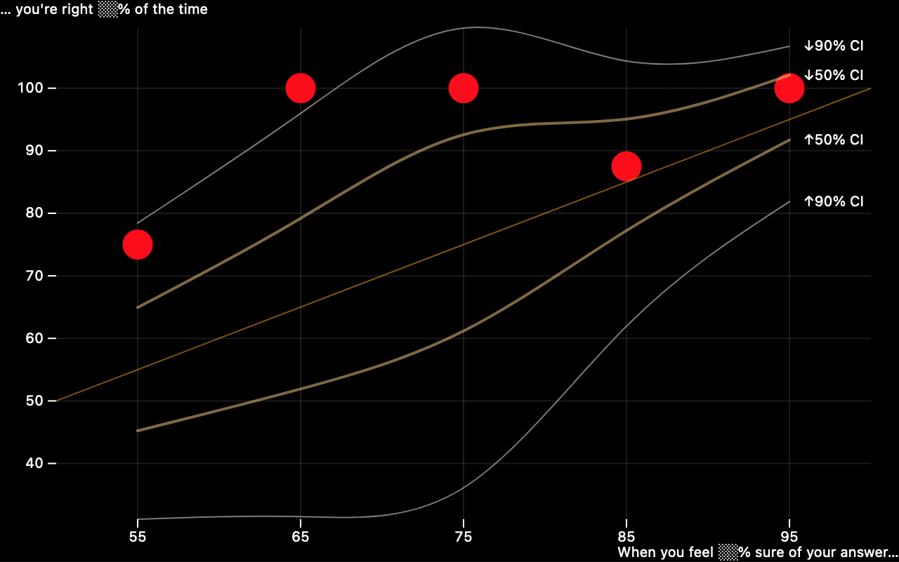

# Devastate

Calibrate your uncertainty at https://fasiha.github.io/devastate/

Check out my predicted-vs-actual plot and tell me how to be more risk-on:



- 55% ➜ 75.0% = 9/12: [9 13 18 21 26 27 28 30 34] right vs [2 7 19] wrong
- 65% ➜ 100.0% = 6/6: [3 5 8 23 24 33] right vs [] wrong
- 75% ➜ 100.0% = 4/4: [12 20 32 40] right vs [] wrong
- 85% ➜ 87.5% = 7/8: [4 6 15 22 25 36 37] right vs [10] wrong
- 95% ➜ 100.0% = 10/10: [1 11 14 16 17 29 31 35 38 39] right vs [] wrong

## Reading
- Seriously, go read Julia Galef's *The Scout Mindset*. I found out about it from Dan Luu's post, ["Cocktail ideas"](https://danluu.com/cocktail-ideas/). Luu [tweeted](https://twitter.com/danluu/status/1477789639423320064), "There are 6 blog posts that were on my to-do list that I think I don't need to write anymore since the book describes what I wanted to describe, but better than I would've done it."
- I also liked *Superforecasting* (Tetlock and Gardner) and *Everything is Obvious (Once You Know the Answer)* (Duncan Watts).
- Umm, you might like my blog post about calibrating your subjective feeling about a probability via my Texas hold 'em app? ["Learning about risk, for kids and grownups"](https://fasiha.github.io/post/risk-for-kids-and-grownups/) (this isn't mentioned on the actual site)
- Since we're talking about reading that's maybe more ancillary: I loved Aaron Brown's *Poker Face of Wall Street* because it talks about uncertainty when it's forced down your throat by the world, i.e., when you don't have an app giving you probabilities and when you're not establishing your own subjective probabilities.
- I'm working through Annie Duke's *Thinking in Bets* too, which is probably really in line with uncertainty calibration.

## Tech
- TypeScript
- React, Redux, Redux Toolkit
- Plots via [ObservableHQ's Plot](https://observablehq.com/@observablehq/plot) (same folks that made D3)
- Snowpack; Create Snowpack App
- CSS adapted from https://perfectmotherfuckingwebsite.com/

## Math
Galef just sketches how to anchor your performance on this game: the fraction of questions you got correct within each confidence bucket should more or less match that confidence's probability. There's a way to make this quite rigorous, and as we'll see, that extra rigor is actually useful when it comes to interpeting your results.

So in statistics, there's a probability distribution called the binomial distribution. This is one of the first probability distributions described formally: Jacob Bernoulli described many of its properties in the late 1600s. It's traditionally described as the distribution that arises when you flip a `p`-weighted coin `n` times—that is, if you have a coin that comes up heads with probability `p` and you flip it `n` times in a row, how many times does it come up heads? We know it's between `0 <= k <= n`, and the binomial distribution assigns the probability to each `k` for given `p` and `n`.

This of course exactly matches our application. My friend Hatem answered five questions that he assigned 85% confidence to and got three of them right, for an actual frequency of 3/5=60%. If you have Python and Scipy, you can ask it for the binomial probability of him getting `k=0...5` right:
```py
from scipy.stats import binom as binomrv
for k in range(6):
  print(f'- Probability(k = {k}) = {binomrv.pmf(k, 5, 0.85):0.3f}')
```
And here's the output:
- Probability(k = 0) = 0.000
- Probability(k = 1) = 0.002
- Probability(k = 2) = 0.024
- Probability(k = 3) = 0.138 👈 Hatem's actual result
- Probability(k = 4) = 0.392 👈 higher probability
- Probability(k = 5) = 0.444 👈 *highest* probability!

We know that Hatem's empirical frequency of 3/5=60% is lower than the ideal of 85% (which is the confidence he assigned his answers to these five questions). This shows a surprising fact: in the ideal case, a perfectly-calibrated person who answered five questions with 85% confidence would get all five right, and get 5/5=100% frequency, *more often* than 4/5=80%, even though 80% is closer to 85% than 100%.

That surprised me!

Similarly, Hatem answered four questions with 55% confidence and got 3 of them right. So 75% actual frequency versus 55% confidence: seems pretty uncalibrated right? But Python says (`binomrv.pmf(3, 4, 0.55)`) this has probability 0.300, which is quite a bit higher, *almost double* the probability in the `k=3` bullet for the `n=5, p=0.85` case above, 0.138.

That is, answering 3/4=75% right at 55% confidence is much better calibrated than answering 3/5=60% at 85% confidence.

So it's clear that if we want to make sense of the five dots (our actual frequency of correctness vs our subjective probability) correctly, we could use some statistics. Specifically, we need to see *confidence intervals* for each of the five dots to tell us how well we did, for the actual number of `n` we answered for each confidence level.

> I'm using "confidence interval" as a technical phrase to refer to the probability concept desscribed below. I also use the word "confidence" to refer to the five subjective probabilities in Galef's book, 55%, 65%, 75%, 85%, and 95%, but the two usages are unrelated.

A `P`-percentile confidence interval (where `P` might be fifty, ninety, etc., some number between one and ninety-nine) is two numbers, call them `k1` and `k2`, such that
- `Probability(k1 <= k) = (100 - P / 2) / 100` and
- `Probability(k <= k2) = (100 + P / 2) / 100`

for a fixed `n` and `p`. That is, for the `P=50` percentile, there's a range of correct answers, `k1` to `k2`. For `P=75` or `P=90` confidence intervals, the bounds get steadily wider because *more* of the binomial distribution's weight is captured between those boundaries. If your `k` correct answers are within the fifty-percentile confidence interval, you're doing *better* than if your `k` is within the seventy-fifth percentile.

So the thing is…

While ordinarily confidence intervals are easy to calculate, *binomial* confidence intervals are iffy, because the binomial is a *discrete* distribution. It can tell you the probability of answering three (`k`) out of four (`n`) questions correctly if the probability of being correct is `p=0.55`, but when you ask it for which `k1` satisfies this equation: `Probability(k1 <= 3; n=3, p=0.55) = 0.25`, that is, what `k1` is at the twenty-fifth percentile of the distribution, it can only answer with an *integer*. Below we ask it for the fifth, twenty-fifth, seventy-fifth, and ninety-fifth percentile `k1`s:
```py
from scipy.stats import binom as binomrv
print(binomrv.ppf([0.05, 0.25, 0.75, 0.95], 4, .55))
# [1, 2, 3, 4]
```
and see that the standard binomial distribution's machinery just returns integers for the percent point function ([`ppf`](https://docs.scipy.org/doc/scipy/reference/generated/scipy.stats.binom.html), the inverse of the cumulative distribution function (CDF), i.e., percentiles).

Plotting these as confidence intervals is unappealing because these can *collapse* the bounds of confidence intervals in an unpleasant way. Consider this:
```py
print(binomrv.ppf([0.05, 0.25, 0.75, 0.95], 14, .95))
# [12, 13, 14, 14]
```
My friend Aubrey got correct all `k=14` of `n=14` questions she marked as 95% (`p=.95`), and Scipy can just give me the same number (14) for the seventy-fifth *and* ninety-fifth percentiles (these are the tops of the 50-percentile confidence interval and the 90-percentile confidence interval respectively). Is she closer to the fifty-percentile confidence interval or the nintety-percentile? This won't tell us.

So while the ordinary binomial distribution can certainly give us some confidence intervals, it'd be nice if we could find a *continuous* extension of the binomial distribution to help give us more aesthetically-pleasing confidence intervals.

There's this R package called [`cbinom`](https://rdrr.io/cran/cbinom/man/cbinom.html) that implements a [2013 paper](https://arxiv.org/abs/1303.5990) by Andreii Ilienko, but I didn't like how that construction results in a probability mass function (PMF) that's shifted from the ordinary binomial.

So I managed to construct my own continuous extension to the binomial distribution 😇 and it leverages the wonderful [mpmath](https://mpmath.org) library because I did not want to do any Real Math—quadrature integration for life! The details are in [`confidenceIntervals.py`](./math/confidenceIntervals.py), but here's the gist of it.

The standard binomial PMF can readily be extended to fractional `k`, up to a normalization factor, which we compute via numerical integration. So you still need a fixed integer `n >= 1` and fixed `0 <= p <= 1`, but now `k` is allowed to be real and `0 <= k <= n + 1`. Here's some example probability mass functions:


With the probability mass function readily implemented, we can compute the confidence intervals using mpmath's support for numerical quadrature integration and root finding. It's about as brute-force an approach as imaginable so there's no point in going on about it 🙃.

Then, since of course we don't want to be integrating things in JavaScript, I generate a bunch of relevant confidence intervals for the `p`, `n` and `k` values that are in our app, save them to JSON, and that's what the app uses.

## Name
> Ay imma celebrate  
> Had a good year, need to calibrate  
> For you slow h—s imma paraphrase  
> I’m a heavyweight, bitch I devastate them

—Awkwafina, [*Pockiez*](https://www.youtube.com/watch?v=YsSre22qito)